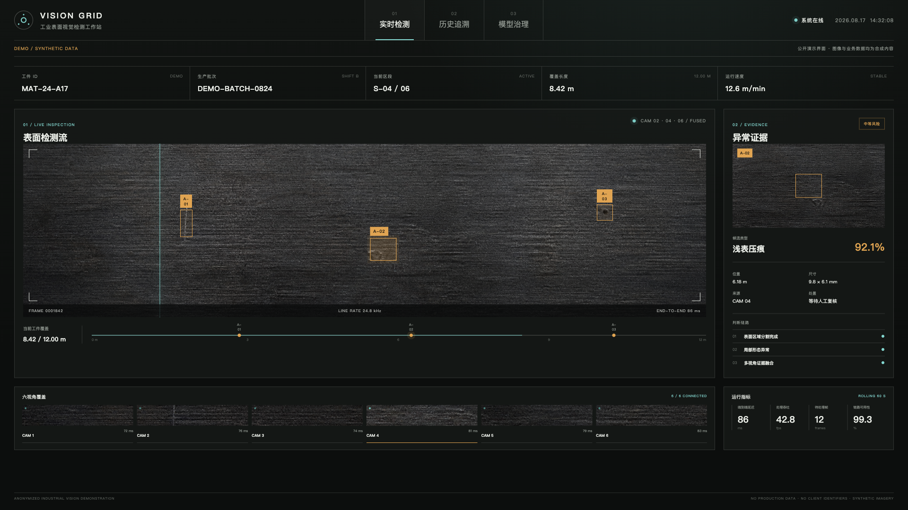
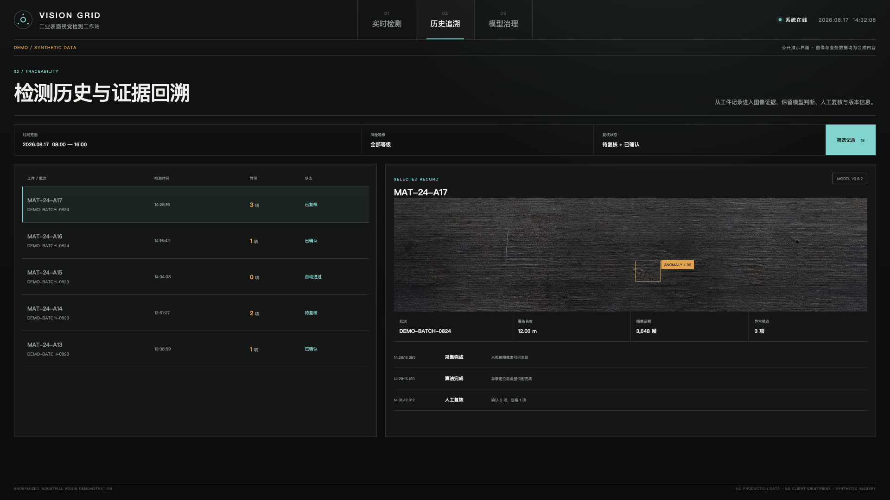
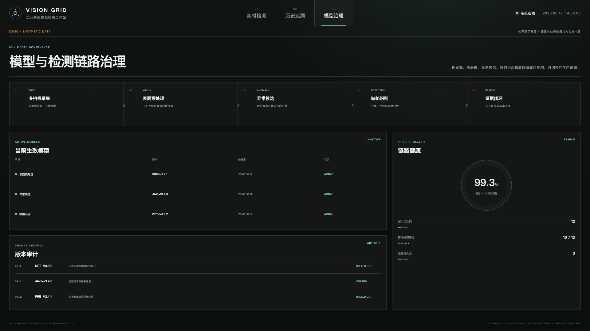

# Vision Grid Demo

一个只使用合成图像与模拟数据的工业表面视觉检测界面，用于公开作品集展示、界面原型研究和截图演示。

本项目采用 [GNU General Public License v3.0](LICENSE)，SPDX 标识为 `GPL-3.0-only`。

## 安全边界

- 不包含客户名称、企业标识、生产图片、真实业务编号、内网地址或账号。
- 不连接任何后端、WebSocket、PLC、L2 或现场运维接口。
- 页面中的工件、批次、性能指标、异常类型与模型版本均为演示数据。
- 页面固定显示 `DEMO / SYNTHETIC DATA`，截图不应裁掉该标识。

## 页面内容

- 实时检测：多视角覆盖、合成线扫图、异常候选、证据链与运行指标。
- 历史追溯：演示记录、图像证据、模型版本与复核日志。
- 模型治理：采集到复核的处理链路、模型注册表、健康状态与版本审计。

## 界面预览

### 实时检测



### 历史追溯



### 模型治理



## 本地运行

```bash
npm install
npm run dev
```

生产构建与测试：

```bash
npm run build
npm test
npm run test:e2e
```

## 素材说明

`public/demo/synthetic-line-scan-surface.png` 由 OpenAI 图像生成工具创建，用作无品牌、非生产环境的合成工业表面纹理。它不来自真实客户或生产现场。

## 开源发布说明

本仓库由去敏后的展示工作树重新初始化，不包含原生产仓库的 Git 历史、客户素材、生产配置或模型权重。

本项目采用 `GPL-3.0-only`。公开发布代表代码权利人确认有权以该许可证发布仓库中的代码与素材。
